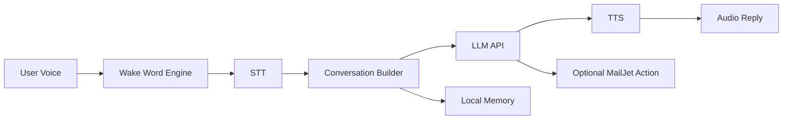

<div align="center">

# Anime Waifu Voice Assistant

**Zero Two-inspired Flutter app with wake word activation, live voice chat, and personality-driven AI replies.**

<p>
  
  
  
  
</p>


</div>

---

## Why This App Feels Different
- Wake word listener with **Porcupine** (`Baby-girl`, `Zero-two`, `Darling`)
- Conversational memory with assistant mode persistence
- Full voice loop: **Speech-to-Text -> LLM -> Text-to-Speech**
- Mail task support through MailJet integration
- Stylized Zero Two theme and animated interaction states

## Tech Stack
| Layer | Tools |
|---|---|
| UI | Flutter, Material |
| Voice Input | `speech_to_text` |
| Voice Output | `flutter_tts` |
| Wake Word | `porcupine_flutter` |
| Networking | `http` |
| Config | `flutter_dotenv` |
| Local State | `shared_preferences` |

## Architecture (High-Level)


## Project Structure
```text
lib/
  main.dart                        # App entry + main chat UI
  api_call.dart                    # LLM + MailJet calls
  stt.dart                         # Speech recognition service
  tts.dart                         # Text-to-speech service
  load_wakeword_code.dart          # Wake word lifecycle and fallback logic
  models/chat_message.dart         # Chat message model
  services/assistant_mode_service.dart
  config/app_theme.dart
  config/system_persona.dart
  debug/wakeword_debug.dart        # Debug route: /wake-debug
assets/
  wakeword/
    Baby-girl_en_android_v4_0_0.ppn
    Zero-two_en_android_v4_0_0.ppn
    Darling_en_android_v4_0_0.ppn
```

## Quick Start
### 1. Install dependencies
```bash
flutter pub get
```

### 2. Configure environment
Create `.env` in project root:

```env
API_KEY=your_llm_api_key
MAIL_JET_API=your_mailjet_api_key
MAILJET_SEC=your_mailjet_secret
WAKE_WORD_KEY=your_picovoice_access_key
# Optional fallback key name supported by code:
# PICOVOICE_KEY=your_picovoice_access_key
```

### 3. Run the app
```bash
flutter run
```

### 4. Release build (Android)
```bash
flutter build apk --release
```

## Security Notes
- Never commit `.env` with real keys.
- If secrets were exposed before, rotate them immediately.
- Keep production keys scoped and revocable.

## Runtime Requirements
- Microphone permission is required for wake word and STT.
- Wake word `.ppn` models must be present in `assets/wakeword/`.

## Troubleshooting
<details>
<summary><b>Wake word is not starting</b></summary>

- Verify `WAKE_WORD_KEY` or `PICOVOICE_KEY` is valid.
- Confirm `.ppn` files exist under `assets/wakeword/`.
- Rebuild cleanly:

```bash
flutter clean
flutter pub get
flutter run
```
</details>

<details>
<summary><b>No AI response from chat</b></summary>

- Check `API_KEY` in `.env`.
- Ensure device internet connection is active.
- Review model/API overrides (if changed in dev settings).
</details>

<details>
<summary><b>Mail sending fails</b></summary>

- Validate `MAIL_JET_API` and `MAILJET_SEC`.
- Confirm destination email is present in generated instruction.
</details>

## UI Preview
<div align="center">
  
  
  
</div>

---

<div align="center">
Made with Flutter for immersive voice-first anime assistant experiences.
</div>
